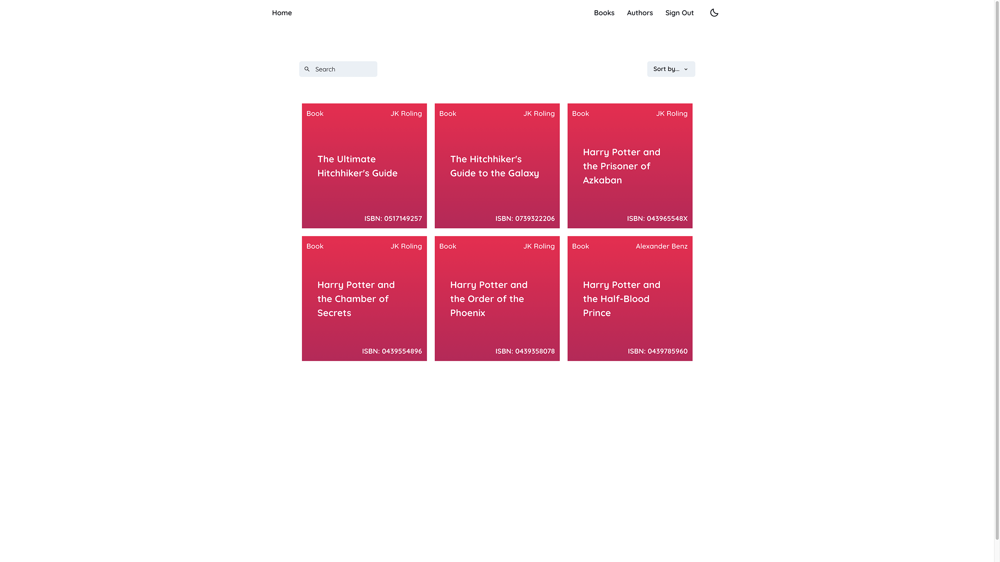
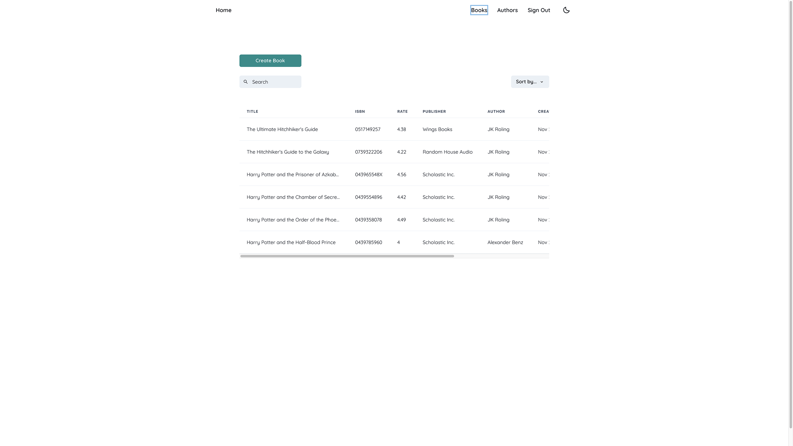
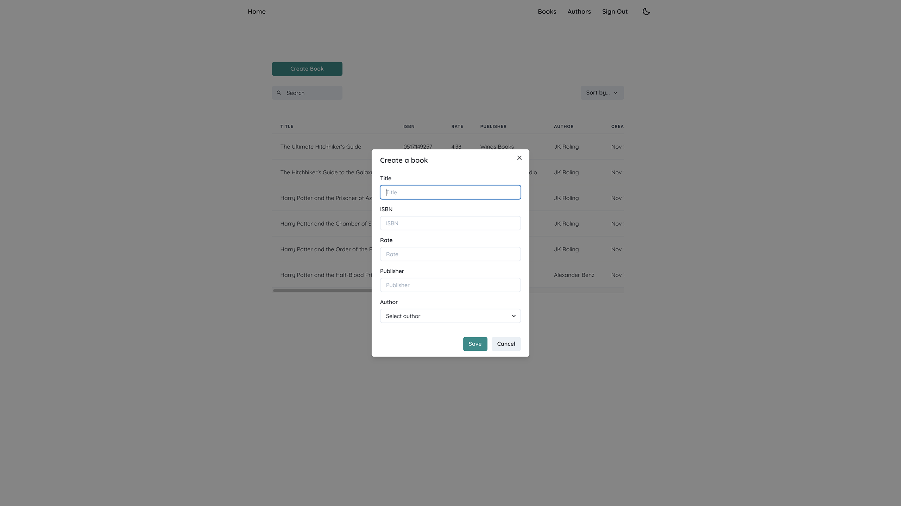
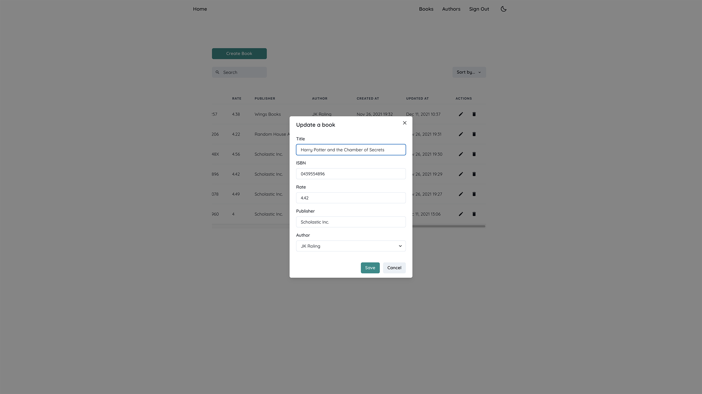
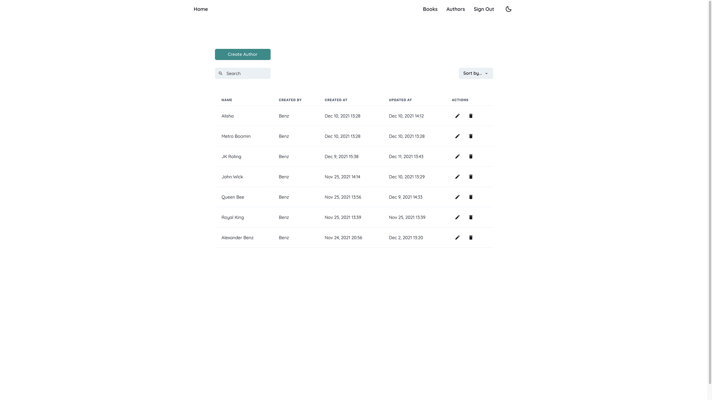
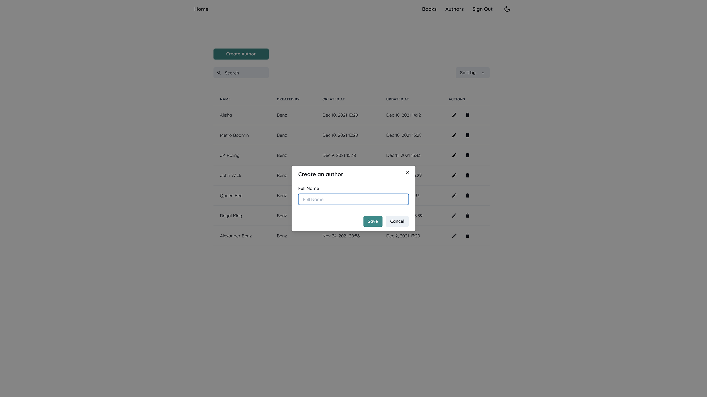
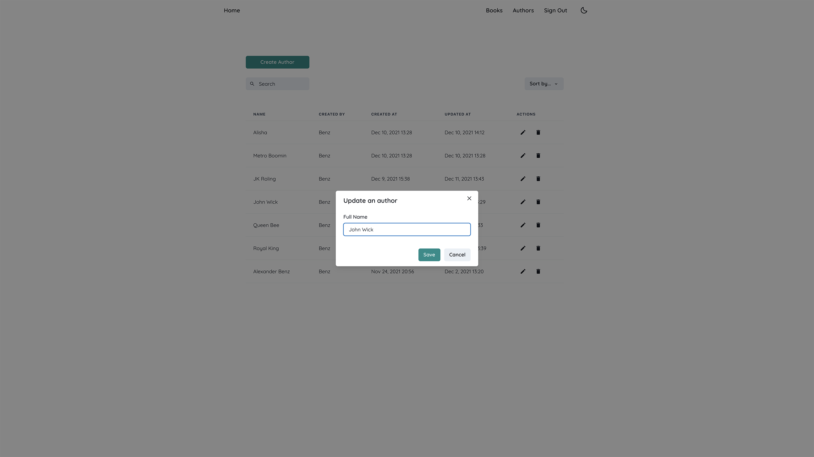
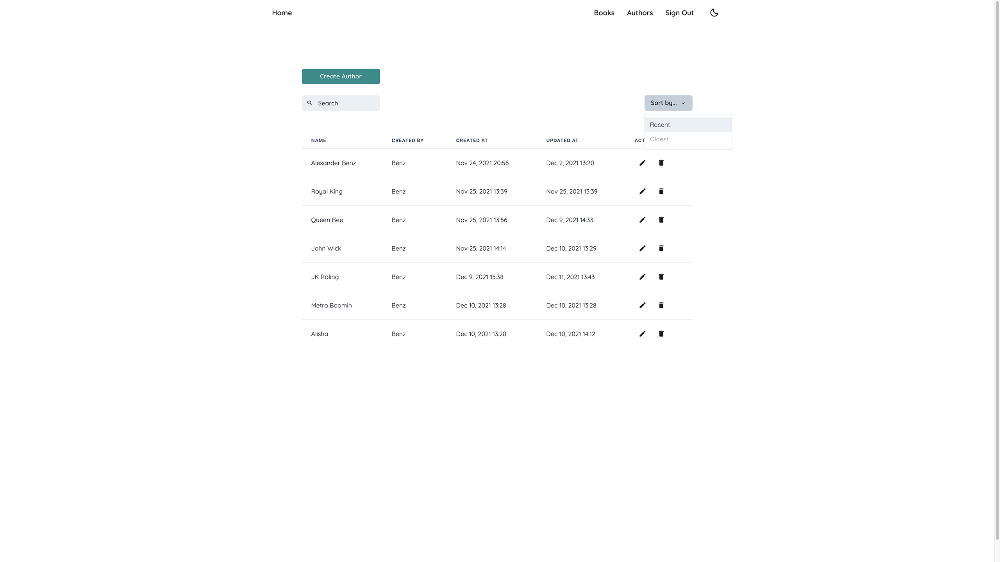
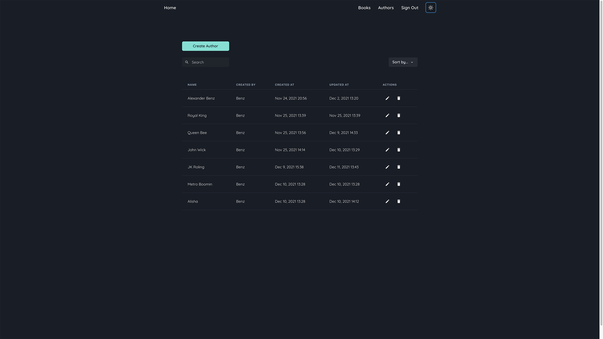

# Book GraphQL - API CRUD Operations

## Background

Book GraphQL is a book management app using GraphQL and React. And, there will be client and server-side for the CRUD operations.

## Technology Stack and Tools

### Client App

- React
- Redux | Redux Persist
- Reselect
- TypeScript
- Apollo Client
- GraphQL
- Chakra UI
- DayJS
- React Router DOM
- React Hook Form

### Server App

- NestJS
- Apollo Server Express
- Bcrypt
- Cookie Parser
- GraphQL
- JWT
- Mongoose
- MongoDB
- Nanoid
- RxJS
- TypeScript

## Features

- Dark / Light mode via Chakra UI
- Search and Filter
- Sign In / Sign Up for User
- CRUD Authors' page
- CRUD Books' page

## Members and Roles

SOKVATHARA LIN: Full-Stack Developer

## Licenses

Content is released under the consent of the member who developed this very system. Any individual is allowed to use our project freely due to we have open-sourced this project.

## Screenshot

